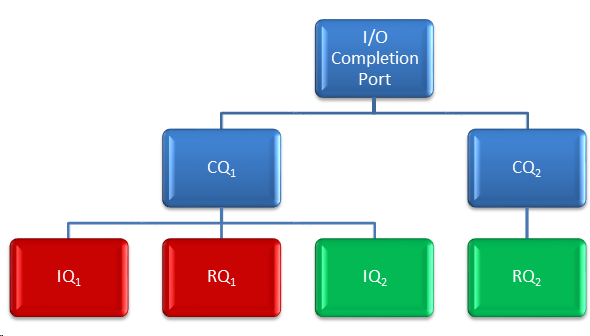

# IND2CompletionQueue interface
Use to indicate the completion of an outstanding request, for example, a Send or Receive request. 
The [IND2Adapter::CreateCompletionQueue](./IND2Adapter.md#ind2adaptercreatecompletionqueue) method returns this interface.

The IND2CompletionQueue interface inherits from [IND2Overlapped](./IND2Overlapped.md).
In addition, IND2CompletionQueue defines the following methods:

- [__GetNotifyAffinity__](#ind2completionqueuegetnotifyaffinity) - Returns the assigned affinity for processing Notify requests.
- [__Resize__](#ind2completionqueueresize) - Modifies the number of results entries that a completion queue supports.
- [__Notify__](#ind2completionqueuenotify) - Requests notification for errors and completions.
- [__GetResults__](#ind2completionqueuegetresults) - Retrieves the request completion results from the completion queue.

__Remarks:__

Initiator and Receive request queues of one or more queue pairs can be bound to a single completion queue. Initiator and Receive request queues of a single queue pair can be bound to different completion queues. Completion queues operate in a similar manner to I/O completion ports, but completion queues are specific to queue pair data transfer operations. Completion queues can have completion notification events sent to I/O completion ports.


 
For example, in the above diagram, queue pair 1 (colored red) has its Initiator request queue (IQ1) and Receive request queue (RQ1) bound to the same completion queue (CQ1). Queue pair 2 (colored green) has its initiator request queue (IQ2) bound to the same completion queue as queue pair 1 (CQ1). However, it has its Receive request queue (RQ2) bound to a dedicated completion queue (CQ2).

I/O requests do not use the traditional OVERLAPPED mechanisms, but they do provide the user the ability to associate a context with each I/O request that is returned through the completion queue when that request completes. I/O requests can be issued and processed without any kernel transitions. Likewise, I/O completions can also be detected and processed without any kernel transitions.

## IND2CompletionQueue::GetNotifyAffinity
Returns the assigned affinity for processing Notify requests.
```
HRESULT GetNotifyAffinity(
 [out] USHORT* pGroup,
 [out] KAFFINITY* pAffinity
);
```

__Parameters:__
- __pGroup__ [out] 

  The processor group number. On operating systems that don’t support processor groups, this value is returned as zero.
- __pAffinity__ [out] 

  A bitmap that specifies the processor affinity within the specified group.

__Return Value:__

When you implement this method, you should return the following return values. If you return others, try to use well-known values to aid in debugging issues.

- __ND_SUCCESS__ - The operation succeeded.
- __ND_INSUFFICIENT_RESOURCES__ - The requested number of entries could not be allocated.
- __ND_INVALID_PARAMETER__ - The pGroup or pAffinity parameters were invalid.
- __ND_DEVICE_REMOVED__ - The underlying NetworkDirect adapter was removed from the system. Only cleanup operations on the NetworkDirect adapter will succeed.
- __ND_NOT_SUPPORTED__ - The underlying NetworkDirect adapter does not support setting affinity for Notify requests.

__Implementation Notes:__

NetworkDirect service providers are encouraged to return affinity information for Notify request completion processing even if they don’t support specifying affinity, rather than returning ND_NOT_SUPPORTED. This allows client code to optimize their notification strategy and CPU usage, especially if all notifications go to the same processor.

## IND2CompletionQueue::Resize
Modifies the number of result entries that a completion queue supports.
```
HRESULT Resize(
 [in] ULONG queueDepth
);
```

__Parameters:__
- __queueDepth__ [in] 

  The new number of completions that the completion queue can hold.

__Return Value:__

When you implement this method, you should return the following return values. If you return others, try to use well-known values to aid in debugging issues.

- __ND_SUCCESS__ - The operation succeeded.
- __ND_INSUFFICIENT_RESOURCES__ - The requested number of entries could not be allocated.
- __ND_INVALID_PARAMETER__ - The requested number of entries exceeds the capabilities of the hardware.
- __ND_DEVICE_REMOVED__ - The underlying NetworkDirect adapter was removed from the system. Only cleanup operations on the NetworkDirect adapter will succeed.
- __ND_NOT_SUPPORTED__ - The underlying NetworkDirect adapter does not support resizing of completion queues. ND_ADAPTER_FLAG_CQ_RESIZE_SUPPORTED flag in _AdapterFlags_ of [ND2_ADAPTER_INFO](./IND2Adapter.md#nd2_adapter_info-structure) indicates whether resizing of a completion queue is supported.

__Implementation Notes:__

Provider implementations may allocate more entries than requested, though there are no mechanisms for advertising these extra entries to clients.

__Remarks__

To get the limits that are supported by a NetworkDirect adapter, call the [IND2Adapter::Query](IND2Adapter.md#ind2adapterquery) method. 

You can increase or decrease the size of the queue. If the number you specify is less than the number of results in the queue, the method returns ND_BUFFER_OVERFLOW (the queue remains unchanged).

Providers must ensure that completions do not get lost during a resize operation. Users are not required to quiesce communication before resizing their completion queues. 

## IND2CompletionQueue::Notify
Requests notification for errors and completions.
```
HRESULT Notify(
 [in] ULONG type,
 [in] OVERLAPPED *pOverlapped
);
```

__Parameters:__
- __type__ [in] 

  Specifies the type of notification to receive. The following values are possible:

  - __ND_CQ_NOTIFY_ERRORS__
    
    The Notify request will complete if there are any completion queue errors such as a completion queue overrun or catastrophic failure.
  - __ND_CQ_NOTIFY_ANY__

    The Notify request will complete on the next successful completion in the completion queue.
  - __ND_CQ_NOTIFY_SOLICITED__

    The Notify request will complete when the completion queue receives a Send request that includes the ND_OP_FLAG_SEND_AND_SOLICIT_EVENT flag.

- __pOverlapped__ [in] 

  A pointer to an [OVERLAPPED](https://docs.microsoft.com/windows/desktop/api/minwinbase/ns-minwinbase-_overlapped) structure that must remain valid for the duration of the operation.

__Return Value:__

When you implement this method, you should return the following return values. If you return others, try to use well-known values to aid in debugging issues.

- __ND_SUCCESS__ - The operation succeeded.
- __ND_PENDING__ - The completion notification request was successfully queued to the completion queue.
- __ND_INTERNAL_ERROR__ - The completion queue experienced a catastrophic error and it is unusable. All associated queue pairs are also unusable. No future completions will be reported. This is generally indicative of a hardware failure.
- __ND_BUFFER_OVERFLOW__ - The completion queue attempted to queue more than the maximum number of completions and it is now unusable. All associated queue pairs are also unusable. No future completions will be reported. This is generally indicative of a programming error.
- __ND_CANCELED__ - The completion queue was destroyed.
- __ND_INSUFFICIENT_RESOURCES__ - The request for notification could not be queued.
- __ND_DEVICE_REMOVED__ - The underlying NetworkDirect adapter was removed from the system. Only cleanup operations on the NetworkDirect adapter will succeed.

__Remarks__

You can use this method to get notification when a request completes and then use the notification to trigger calls to the [IND2CompletionQueue::GetResults](get-results) method.

The Notify overlapped requests are completed if there are new completions since the last notification. The completions that triggered the overlapped request to be completed will not cause a subsequent Notify request to be completed. A completion will cause at most a single triggering of the completion queue (but it could complete multiple overlapped requests if they are queued simultaneously). For example, 
1.	The client calls Notify, which returns pending.
2.	The hardware adds a new completion to the completion queue.
3.	The hardware driver completes the Notify request.
4.	The client calls GetResults, which returns 1 (the first completion).
5.	The client calls GetResults, which returns 0 (no more completions).
6.	The client calls Notify, which returns pending.
7.	The hardware adds a new completion to the completion queue.
8.	The hardware driver completes the Notify request.
9.	The client calls GetResults, which returns 1 (the first completion).
10.	The client calls GetResults, which returns 0 (no more completions).
11.	The client calls Notify, which returns pending.

When notified, applications are expected to call GetResults until all completions have been returned (all completions are returned if the value that GetResults returns is less than the value of the nResults parameter) because more than one entry could be written to the completion queue before a pending Notify request is completed. 

Multiple requests for notification can be outstanding for the same completion queue. All such requests will be completed by the next completion event on the specified completion queue. This is similar to a notification event that releases all waiting requests, rather than a synchronization event that releases, at most, one. This allows multiple threads to process completions in parallel. 

By default, completion queues are not set to generate completion notifications. This method rearms the completion queue for the desired event type.

Requests for ND_CQ_NOTIFY_ANY take precedence over requests for ND_CQ_NOTIFY_SOLICITED. If a request for ND_CQ_NOTIFY_ANY is issued when a request for ND_CQ_NOTIFY_SOLICITED is outstanding, then it changes the notification type to ND_CQ_NOTIFY_ANY. 

__Implementation Note:__

Service providers can peek at their completion queues after rearming to see if the next entry holds a valid completion, and if so, immediately complete the request. This does not require mapping completion queue ring buffers to the kernel because the user memory can be dereferenced while in the context of the user's thread.

Providers are expected to eliminate potential race conditions that can occur between the time their hardware writes a new completion entry to the completion queue, after the application called [GetResults](#ind2completionqueuegetresults) and received a return value of zero (or less than the value of the nResults parameter), and the application calling [Notify](#ind2completionqueuenotify).

The following two cases effectively provide applications with the same behavior:

__Case 1__

1.	GetResults returns 0.
2.	The hardware adds a new completion to the completion queue.
3.	Notify completes immediately.

__Case 2__

1.	GetResults returns 0.
2.	Notify returns pending.
3.	The hardware adds a new completion to the completion queue.
4.	Notify completes.

Note that for Case 1, step 3 could be broken into the following two steps: 
1.	Notify returns pending.
2.	Notify completes.

The original case merges steps 3 and 4 and completes the request immediately. It does not matter when [Notify](#ind2completionqueuenotify) is called with respect to the hardware that is writing new entries to the completion queue; the only thing that matters is that [GetResults](#ind2completionqueuegetresults) returned all known entries—any entries written to the completion queue after that point should cause a subsequent Notify call to succeed. 

## ND2_RESULT structure
Provides the completion status of a request.

```
typedef struct _ND2_RESULT {
 HRESULT Status;
 ULONG BytesTransferred;
 void *QueuePairContext;
 void *RequestContext;
 ND2_REQUEST_TYPE RequestType;
} ND2_RESULT;
```

- __Status__

  Status of the request. See the following Remarks section for the possible status values based on the type of operation.

- __BytesTransferred__

  The number of bytes transferred by the request. Applies to _Receive_ requests only, and is undefined for other requests.

- __QueuePairContext__

  Queue pair context that is specified in the call to [IND2Adapter::CreateQueuePair](./IND2Adapter.md#ind2adaptercreatequeuepair) or [IND2Adapter::CreateQueuePairWithSrq](./IND2Adapter.md#ind2adaptercreatequeuepairwithsrq).

- __RequestContext__

  Request context that is specified in the call to IND2QueuePair::Send, Receive, Bind, Invalidate, Read, or Write.
  
- __RequestType__

  Type of the request. It can be one of the following:
   - Nd2RequestTypeReceive
   - Nd2RequestTypeSend
   - Nd2RequestTypeBind
   - Nd2RequestTypeInvalidate
   - Nd2RequestTypeRead
   - Nd2RequestTypeWrite

__Remarks:__

The following table lists the possible status values.

- __ND_SUCCESS__ - The operation succeeded.
- __ND_DATA_OVERRUN__ - The scatter/gather entries for a Send, Read, or Write request referenced more data than can be sent by the adapter.
- __ND_BUFFER_OVERFLOW__ - An incoming Send exceeded the buffer space referenced by a Receive request.
- __ND_ACCESS_VIOLATION__ - The scatter/gather entries in a request referenced registered memory that is not valid, or a Bind operation attempted to bind to registered memory that is not valid.
- __ND_CANCELED__ - The request was canceled (generally due to a previous request failing).
- __ND_INVALID_DEVICE_REQUEST__ - The request was improperly formatted.  For example, an Invalidate request attempted to invalidate a memory window that is not bound.
- __ND_INTERNAL_ERROR__ - The queue pair experienced an error while processing this request.
- __ND_IO_TIMEOUT__ - The request timed out due to a connection failure or failure of the remote queue pair.
- __ND_REMOTE_ERROR__ - The request caused an error on the remote queue pair.

The result is added to the completion queue when the request completes.

The following table lists which error codes are valid for the different types of requests.

|                            | Send | Receive | Bind | Invalidate | Read | Write |
|----------------------------|------|---------|------|------------|------|-------|
|ND_SUCCESS                  |Yes   |Yes      |Yes   |Yes         |Yes   |Yes    |
|ND_DATA_OVERRUN             |Yes   |No       |No    |No          |Yes   |Yes    |
|ND_BUFFER_OVERFLOW          |No    |Yes      |No    |No          |No    |No     |
|ND_ACCESS_VIOLATION         |Yes   |Yes      |No    |No          |Yes   |Yes    |
|ND_CANCELLED                |Yes   |Yes      |Yes   |Yes         |Yes   |Yes    |
|ND_INVALID_DEVICE_REQUEST   |Yes   |Yes      |Yes   |Yes         |Yes   |Yes    |
|ND_INTERNAL_ERROR           |Yes   |Yes      |Yes   |Yes         |Yes   |Yes    |
|ND_IO_TIMEOUT               |Yes   |Yes      |No    |No          |Yes   |Yes    |
|ND_REMOTE_ERROR             |Yes   |Yes      |No    |No          |Yes   |Yes    |


## IND2CompletionQueue::GetResults
Retrieves the request completion results from the completion queue.
```
ULONG GetResults(
 [in, out] ND2_RESULT results[],
 [in] ULONG nResults
);
```

__Parameters:__

- __results__ [in, out] 

  An array of ND2_RESULT structures.

- __nResults__ [in] 

  The number of elements in the results array.

__Return Value:__

Returns the number of entries filled in the results array. 

__Remarks:__

You need to call this method until there are no further completions in the completion queue. Use the return value to determine the number of returned results. The method fills in the entries in the array with information about completed requests. The request context that is associated with the request is returned in the [ND2_RESULT](#nd2_result-structure) structure to associate completions with requests.

Within a single queue pair, initiator requests (for example, Send, Read, Write, Bind, and Invalidate) and Receive requests complete in the order they were issued. There is no ordering between queue pairs, so if a request is issued to queue pair A before a request is issued to queue pair B, it does _not_ imply that the request for queue pair A will complete before the request for queue pair B.
